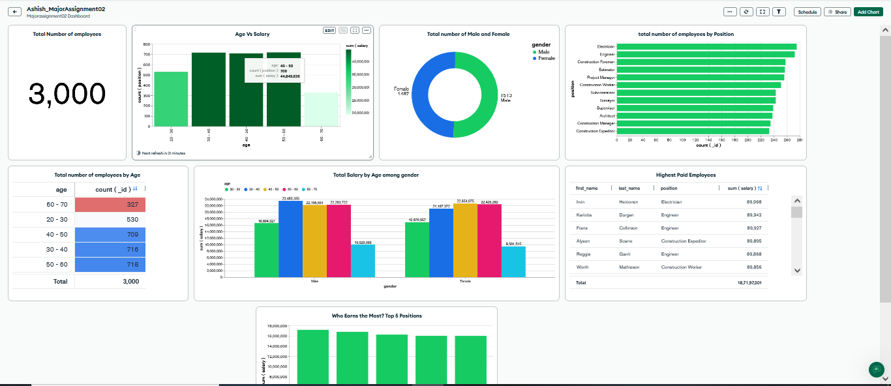
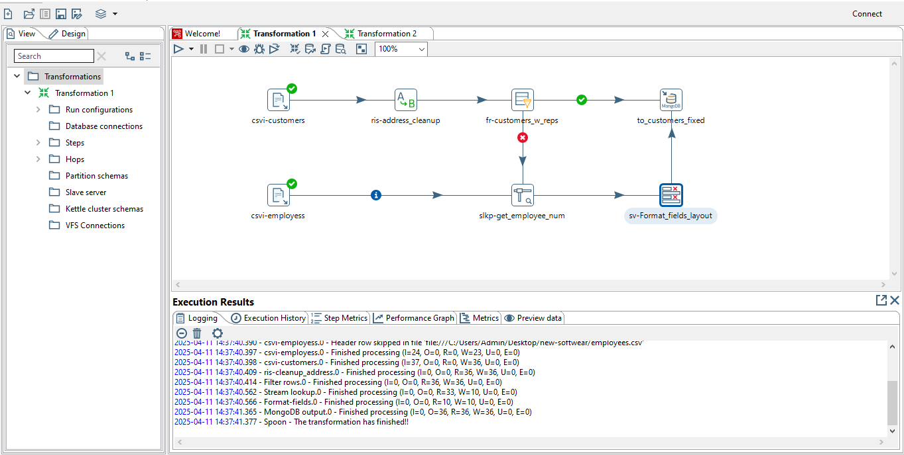

# 📊 MongoDB & Pentaho ETL Integration Project

This project demonstrates the complete data pipeline process of importing, querying, visualizing, and transforming employee data using **MongoDB**, **Pentaho Data Integration (PDI)**, and **MongoDB Atlas Dashboards**.

---

## 📈 Project Overview

* **Project Title**: MongoDB-Pentaho ETL Integration
* **Student Name**: Ashish Pandya
* **Course**: Data Engineering
* **Tools Used**: MongoDB Atlas, mongoimport, MongoDB Shell, PDI (Spoon), Atlas Charts
* **Dataset**: `Employee_DATA.csv`

---

## 💳 Project Objective

* Load employee data into a MongoDB cluster using **mongoimport**
* Perform multiple MongoDB queries using **MongoDB Shell** and validate results
* Build and publish **interactive dashboards** using MongoDB Atlas Charts
* Create a complete **ETL pipeline in Pentaho** to clean, transform, and load data into MongoDB

---

## 💡 Key Tasks Breakdown

### ✅ **Task 1: MongoDB Data Import**

* Imported `Employee_DATA.csv` using `mongoimport`
* Targeted DB: `Ashish_MajorAssignment02`
* Collection: `MyCompanyEmployees`
* Verified using:

  * `mongoimport` success message (CMD snapshot)
  * `db.MyCompanyEmployees.findOne()` result in Mongo Shell

### ✅ **Task 2: MongoDB Queries**

Performed 10 queries, including:

* Filtering on attributes like `position`, `gender`, `age`, `salary`
* Using regex, `$in`, `$and`, `$or`, `$gte`, `$lt`, and `distinct`
* Sample Queries:

  * Top 5 paid female employees
  * Male engineers/architects over 50
  * Employees with last name starting with 'Dow'
  * Employees with names containing "an"
  * Count of distinct positions

### ✅ **Task 3: MongoDB Atlas Dashboard**

* Created 2 visualizations using Atlas Charts:

  * Bar chart: Position-wise average salary
  * Pie chart: Gender distribution
* Dashboard Name: `Ashish_MyCompanyEmployees`

**📸 Dashboard Sample Screenshot**


### ✅ **Task 4: Pentaho ETL Pipeline**

* Designed ETL process using Spoon:

  * Extracted and cleaned data from `Employee_DATA.csv`
  * Joined with customer data
  * Performed validation and layout formatting
  * Loaded into MongoDB Atlas collection:

    * DB: `LO9_ETL_Ashish`
    * Collection: `customer_fixed_Pandya`
* Provided screenshots of full transformation and log output

**📸 ETL Pipeline Screenshot**


---

## 📄 Folder Structure

```
MongoDB-Pentaho-ETL-Project/
│
├── Dataset/
│   └── Employee_DATA.csv
│
├── MongoDB_Scripts/
│   └── Command_Prompt_Query.txt
│
├── Pentaho_ETL/
│   ├── Dashboard.PNG
│   ├── ETL_Pipeline_Screenshot.PNG
│   └── Transformation 2.ktr
│
├── Report/
│   └── Project_Report.docx
│
├── Screen_Shots/
│   └── (Multiple screenshots for all tasks)
```

---

## 🔹 Business Problems Solved

| Concern                   | Solution                                          |
| ------------------------- | ------------------------------------------------- |
| Scaling payroll data      | Normalized into separate MongoDB documents        |
| Complex queries on fields | Efficient MongoDB indexing and filtering used     |
| Need for visual summaries | Used Atlas Charts for intuitive visual reporting  |
| Pipeline automation       | Designed modular, reusable Pentaho transformation |

---

## 👤 Author

**Ashish Pandya**
📘 Data Engineering
📍 Regina, Canada
👉 GitHub: [AshishPandya-AI](https://github.com/AshishPandya-AI)

---

## 📓 License

This project is licensed under the **MIT License** – for academic and educational use.

---
